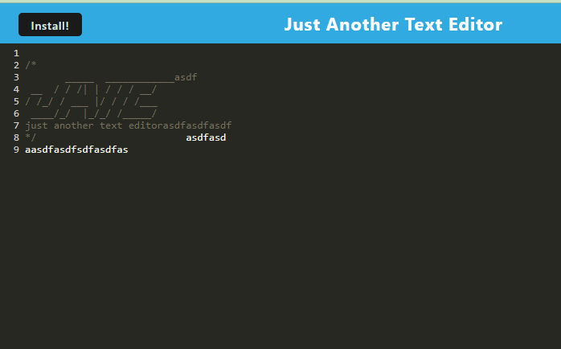

# Awesome Text Editor

## Description

a cool PWA that allows you to install to your pc or phone for offline use

## Table of Contents

- [Installation](#installation)
- [Usage](#usage)
- [License](#license)
- [Contributing](#contributing)
- [Tests](#tests)
- [Questions](#questions)
- [Repo](#repo)

## Installation

clone the repo run npm run install

## Usage

as a cool note taking app

## Contributing

add some more features like more pages.

## Tests

no testing here

## Questions

For any questions, please contact me at [j.browning527@gmail.com](mailto:j.browning527@gmail.com) or visit my [GitHub profile](https://github.com/jbrowning824).

This project is licensed under the MIT License. For more information, see the link below:
    [Lincense Link] (https://api.github.com/licenses/mit)

## Repo

Check out [Project Name](Link) repo

Checkout the deployed site at [Project Name](link)
